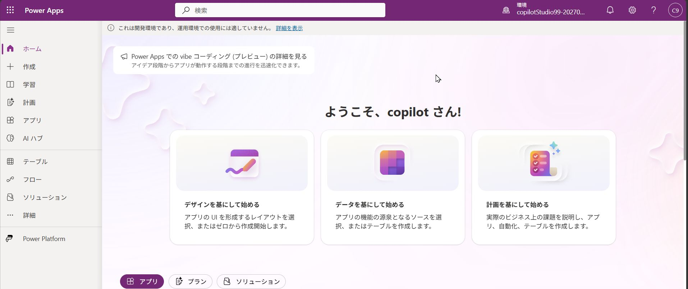
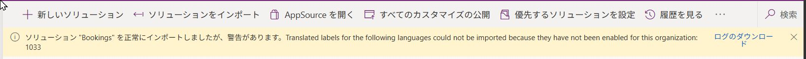
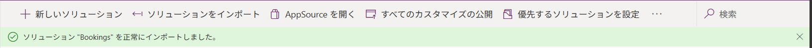
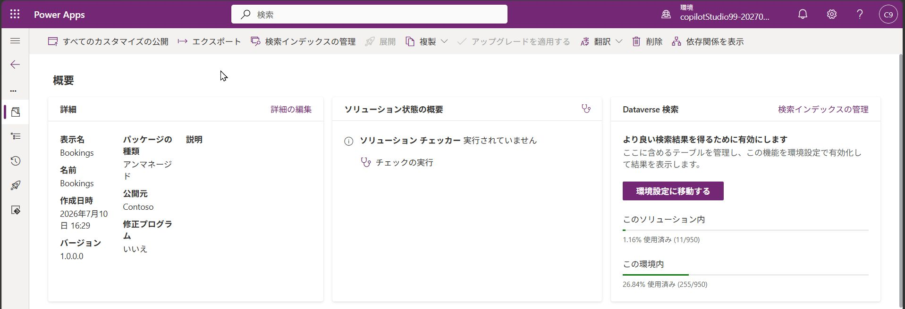
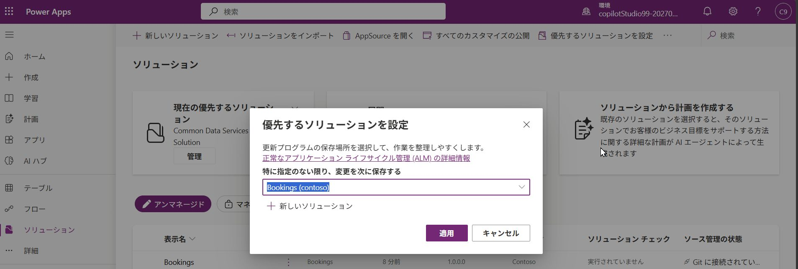
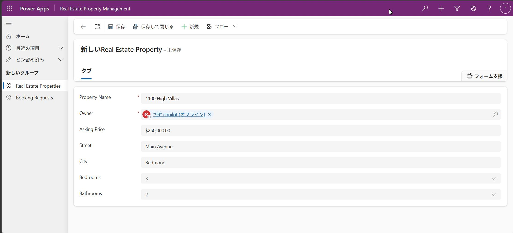

---
lab:
    title: 'Dataverseソリューションのインポート'
    module: 'Microsoft Copilot Studioで初期エージェントを構築する'
---

# Dataverseソリューションのインポート

この演習では、以降のラボで使用するDataverseソリューションをインポートします。

この演習の所要時間は約**10**分です。

> **注意**: この演習は、すでにCopilot Studioのライセンスをお持ちか、[無料試用版](https://go.microsoft.com/fwlink/p/?linkid=2252605)にサインアップ済みで、作業用のPower Platform環境があることを前提としています。

## 演習1 – ソリューションのインポート

この演習では、ラボで必要なテーブルが含まれたDataverseソリューションを環境にインポートします。

### タスク1.1 – ソリューションのダウンロード

1. `https://ctctedu.blob.core.windows.net/share/Bookings_1_0_0_0.zip`にアクセスして、**Bookings_1_0_0_0.zip**ファイルをダウンロードします。

### タスク1.2 – ソリューションのインポート

> **ヒント:** この手順では Power Apps を新しいブラウザータブで開きます。Copilot Studio のタブは後のラボでも使用しますので、閉じずに残しておいてください。

1. 新しいブラウザータブで`https://make.powerapps.com`を開きます。

1. 資格情報の入力を求められた場合は、メールアドレスとパスワードでサインインしてください。

    

1. 連絡先情報の入力を求められた場合は、国/地域を設定して**開始する**を選びます。

1. 画面右上に表示されている **環境** を確認します。環境はPower Platformにおけるエージェントやアプリをわける空間として機能します。
    今回の演習では **copilotstudioXX-YYYYMMDD** （XXは個別の番号、YYYYMMDDは研修日前後の年月日）を使用します。別の名称（CTCテクノロジー株式会社等）が表示されている場合はクリックして **環境を選択** のペインを表示して切り替えを実行します。これはすべてのラボで作業する環境です。今後の作業においても異なる環境になっている場合は、適切な環境を選択してください。

1. 左側のナビゲーションで**ソリューション**を選びます。

1. 上部のバーで**ソリューションのインポート**を選択し、 **参照**を選んで、ダウンロードフォルダーから**Bookings_1_0_0_0.zip**ファイルを見つけて**開く**を選びます。

    

1. **次へ**を選択し、**インポート**を選択します。

    ソリューションはバックグラウンドでインポートされます。これには数分かかる場合があります。ウィンドウを更新してもかまいません。

    > **注意:** 次のステップに進む前に、ソリューションのインポートが完了するまで待ってください。
    > **注意:** ソリューションのインポートが完了すると、警告が出る場合がありますが、画面を更新すると正常にインポートされたとメッセージが変わります。

    

    

1. ソリューションが正常にインポートされたら、一覧から **Bookings** ソリューションの名称をクリックして開き、上部メニュー内の **すべてのカスタマイズの公開**を選択します。

    

### タスク1.3 – 優先ソリューションの設定

1. 左側のナビゲーションで **ソリューションに戻る（左矢印アイコン）**  を選びます。

1. 画面上部の **優先するソリューションを選択** のボタンをクリックして、**Bookings (contoso)** を選択、**適用**をクリックします。

    

### タスク1.4 – テストデータの作成

1. 再び、**Bookings**ソリューションを開きます。

1. 表示名が **Real Estate Property Management** となっているものの内、種類が **モデル駆動型アプリ** となっている行の**三点リーダー …** をクリックして、**再生**を選択します。これはシンプルなモデル駆動型アプリで、新しい不動産物件レコードを作成できます。

> **注意:** 同じ名前のオブジェクトがあるので注意をしてください。種類が**モデル駆動型アプリ**のデータから**再生**を選びます。

1. 画面上部の **+ 新規** を選択します。

1. 次のデータを入力します:

    - **Property Name:**

        ```
        1100 High Villas
        ```

    - **Owner:** 自分のユーザーを選択（提供されたユーザー名で検索）

    - **Asking Price:**

        ```
        250,000
        ```

    - **Street:**

        ```
        Main Avenue
        ```

    - **City:**

        ```
        Redmond
        ```

    - **Bedrooms:**

        ```
        3
        ```

    - **Bathrooms:**

        ```
        2
        ```

    

1. **保存して閉じる**を選びます。

1. **+ 新規**を選択します。

1. 次のデータを入力します:

    - **Property Name:**

        ```
        555 Oak Lane
        ```

    - **Owner:** 自分のユーザーを選択

    - **Asking Price:**

        ```
        300,000
        ```

    - **Street:**

        ```
        Oak Lane
        ```

    - **City:**

        ```
        Denver
        ```

    - **Bedrooms:**

        ```
        4
        ```

    - **Bathrooms:**

        ```
        3
        ```

1. **保存して閉じる**を選びます。

これで、ビューに2件のアクティブな不動産物件が表示されています。この後の内容で、これらのデータをナレッジとしてエージェントの回答に使用します。
