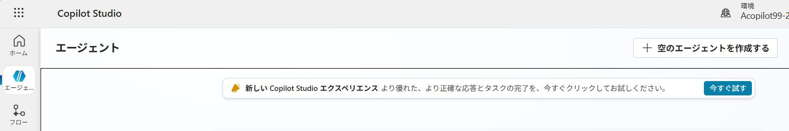
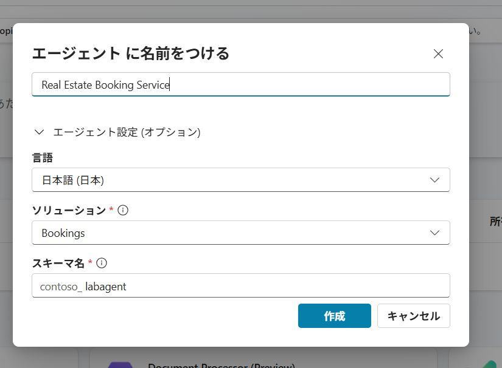
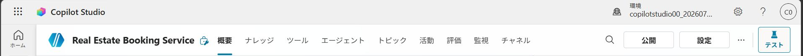

---
lab:
    title: '初期エージェントの構築'
    module: 'Microsoft Copilot Studioでトピックを管理する'
---

# 初期エージェントの構築

## シナリオ

この演習では、以下を実施します:

- エージェントを作成して名前を付ける
- エージェントが何をすべきかの説明を追加する
- 生成AI回答を構成する

この演習の所要時間は約**15**分です。

## 学習内容

- 自然言語を使用してエージェントを作成する方法
- エージェントの生成AI回答を構成する方法

## ラボの概要

- 新しいエージェントを作成する
- エージェントの主な目的と動作方法を指定する
- 生成AIの指示を追加する
  
## 前提条件

- **Lab: Dataverseソリューションのインポート**を完了していること

## 演習1 - エージェントの作成

この演習では、Microsoft Copilot Studioポータルにアクセスし、開発者環境で新しいエージェントを作成します。

### タスク1.1 – Bookingsソリューションでエージェントを作成する

1. 新しいブラウザータブで`https://copilotstudio.microsoft.com`にアクセスします。

    > **ヒント:** Copilot Studio は新しいタブで開きます。Lab02 で使用した Power Apps のタブも後で使うため、閉じないでください。

1. 適切な環境にいることを確認してください。

1. 左側のナビゲーションで**エージェント**を選びます。

    

1. 右上の**空のエージェントを作成** を選択します。

    

1. **名前**に次のように入力します:

    ```
    Real Estate Booking Service
    ```

1. オプションのエージェント設定を開き、**ソリューション**を**Bookings**に変更します。また、**スキーマ名**に次のように入力します:

    ```
    labagent
    ```

1. **確認して作成**を選択します。

> **注意:** 元々提案されていたスキーマ名を削除すると**確認して作成**がグレーアウトする場合は、ポップアップを閉じて上記の手順を繰り返してください。スキーマ名を更新する際は、削除するのではなく提案されたものを選択してから、`labagent`で上書きしてください。また、スキーマ名には接頭辞「contoso_」がついています。

### タスク1.2 – エージェントを構成する

1. **詳細**セクションで**編集**を選択します。

1. **説明**テキストボックスに次のテキストを入力します:

    ```
    不動産物件の予約を作成する
    ```

1. **保存**を選択します。

1. **指示**セクションで**編集**を選択します。

1. 指示を次のテキストに更新して**保存**します:

    ```
    不動産物件の予約作成に関連するトピック用のエージェントを作成します
    ```

1. 右側の**エージェントをテスト**ペインで次のテキストを入力して、応答を確認しましょう:

    ```
    予約をするにはどうすればいいですか？
    ```

このウィンドウは開いたままにしておきます。

## 演習2 - 生成AI回答の追加

この演習では、Microsoft Copilot Studioポータルにアクセスし、エージェントが生成AIを使用して質問に答えるためのナレッジを追加します。

### タスク2.1 - 生成AIオーケストレーションを無効にする

1. エージェントの上部メニュー右側にある　**設定**を選択します（公開、設定とボタンが並んでいます。）。

    

1. **エージェントの応答に生成AIオーケストレーションを使用しますか？** で **いいえ - 従来のオーケストレーションを使用し、エージェントのトピックで定義されたコンテンツと動作に応答を制限します** を選びます。これにより生成AIオーケストレーションが無効になります。**Lab03〜07はトピックによる会話制御を学ぶ段階**のため、エージェントがトピック定義のみで応答することを確認します。Lab08で生成AIとツール・ナレッジを組み合わせた動作を学ぶ際に、再度オンに切り替えます。

1. **保存**を選択します。

1. 設定ウィンドウを閉じます。

### タスク2.2 – ナレッジソースを追加する

1. **ナレッジ**タブを選択し、**+ ナレッジを追加**、 **公式 Webサイト**を選択します。

1. **公式 Webサイトのリンク**テキストボックスに次のURLを入力し、**追加**、そして、**エージェントに追加**を選択します:

    ```
    https://www.realtor.com/marketing/resources
    ```

1. テストペインを開き、**テストのペイン上部** の **省略記号 …** メニューを開き、**トピック間で追跡**を有効にします。

1. **エージェントをテスト**ペイン上部の**新しいテストセッションを開始**アイコンを選択します。

1. **質問を入力するか、必要なことを説明してください**テキストボックスに次のテキストを入力して、応答を確認しましょう:

    ```
    不動産のプロモーションを強化するにはどうすればいいですか？
    ```

1. 追加したナレッジ（Webサイト）が参照されていることを確認してください。
