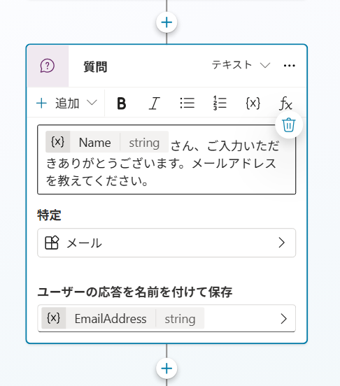
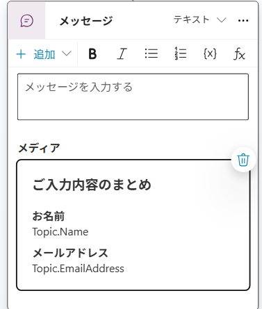
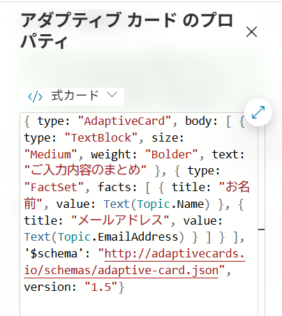
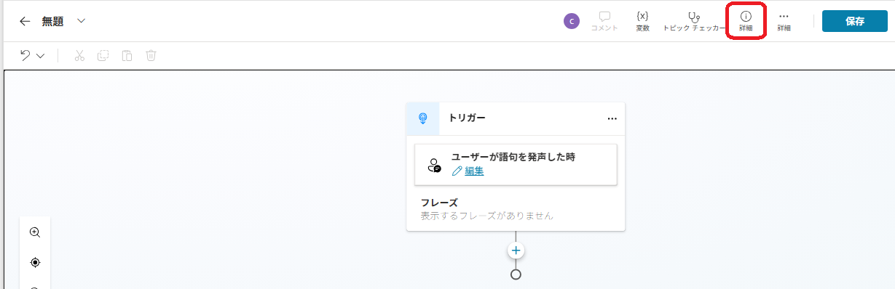

---
lab:
    title: 'トピックの管理'
    module: 'Microsoft Copilot Studioでトピックを管理する'
---

# トピックの管理

## シナリオ

この演習では、以下を実施します:

- 既存のトピックを管理する
- 自然言語を使用してトピックを作成・編集する
- トリガーフレーズを使用してトピックを手動で作成する

この演習の所要時間は約**30**分です。

## 学習内容

- エージェントのトピックを構成する方法

## ラボの概要

- トピックを無効にする
- 自然言語で新しいトピックを作成し、既存のトピックを編集する
- 新しいトピックを作成してトリガーフレーズを追加する
  
## 前提条件

- **Lab: 初期エージェントの構築**を完了していること

## 詳細な手順

## 演習1 - トピックの削除

この演習では、エージェントのトピックを削除します。

### タスク1.1 – トピックを無効にする

1. Microsoft Copilot Studioポータル`https://copilotstudio.microsoft.com`にアクセスし、適切な環境にいることを確認します。

1. 左側のナビゲーションペインから**エージェント**を選びます。

1. 前のラボで作成した**Real Estate Booking Service**エージェントを選択します。

1. **トピック**タブを選択します。

1. **最初からやり直す**トピックの**有効**を**オフ**に切り替えます。

## 演習2 - 自然言語でトピックを作成する

この演習では、エージェントにトピックを作成し、トリガーフレーズを追加します。

### タスク2.1 – Copilotを使用してトピックを追加する

1. **+ トピックを追加**を選択し、**Copilotで説明から作成**を選びます。新しいウィンドウが表示されます。

1. **トピックに名前を付ける** テキストボックスに **`お客様詳細`** と入力します。

1. **次のトピックを作成...** テキストボックスに **`顧客の名前とメールアドレスを尋ねる`** と入力します。

1. **作成**を選択します。

1. **保存**を選択します。

### タスク2.2 – 自然言語でノードを更新する

1. **エージェントをテスト**ペインが開いている場合は、ペインを閉じます。

1. 2番目の**質問**ノード**メールアドレスを教えてください**を選択します。

1. **Copilotで編集する**パネルの **何の操作を実行しますか?** フィールドに、以下のテキストを入力します:

    `選択中の質問ノードのメッセージテキストを変更してください。現在の「メールアドレスを教えてください。」というテキストの前に、入力された名前に感謝の言葉を述べてから、メールアドレスの質問に進むようにしてください。`

    > > **注意:** **Copilotで編集する** パネルが表示されていな場合、もう一度トピックを作り直してください。

1. **更新**を選択します。

    

    > **注意**: メッセージは前のノードの*Name*変数を含むように更新され、上のスクリーンショットのようになるはずです。Copilotで編集が質問ノードを正しく更新しなかった場合は、元に戻すを選択し、別のプロンプトで再試行してください。

1. **保存**を選択します。

### タスク2.3 – 自然言語でノードを追加する

既存のノードを更新するだけでなく、Copilotを使用して新しいノードを追加することもできます。

1. オーサリングキャンバスの空白部分を選択して、ノードが選択されていない状態にします。

1. **Copilotで編集**パネルの **何の操作を実行しますか?** フィールドに、以下のテキストを入力します:

    `収集した情報をアダプティブカードにまとめる`

1. **更新**を選択します。

1. アダプティブカード付きのメッセージノードがトピックの最後に追加されます。

    

1. アダプティブカードの**メディア**ボックスを選択します。ページの右側にアダプティブカードのプロパティが表示されるはずです。

    

   アダプティブカードの式は上記のようになるはずです。そうでない場合は、以下の式を貼り付けることができます:

    ```json
    {
    type: "AdaptiveCard", 
        body: 
        [
            {
                type: "TextBlock",
                size: "Medium",
                weight: "Bolder",
                text: "Summary"    
            },
            {
                type: "FactSet",
                facts: 
                [
                    {
                        title: "Full Name",
                        value: Text(Topic.Name)
                    },
                    {
                        title: "Email Address",
                        value: Text(Topic.EmailAddress)
                    }
                ]
            },
            {
                type: "TextBlock",
                text: "Thank you for providing the information."
            }
        ]
    }
    ```

1. オーサリングキャンバスの空白部分を選択して、ノードが選択されていない状態にします。

1. **何をしたいですか？** フィールドに、以下のテキストを入力します:

    `詳細が正しいかどうかをユーザーに確認する新しい多肢選択質問を追加し、「はい」または「いいえ」の2つのオプションを用意する`

1. **更新**を選択します。

1. ユーザーが選択できるオプション付きの新しい質問ノードがトピックの最後に追加されます。

1. **保存**を選択します。

### タスク2.4 - トピックをテストする

1. **エージェントをテスト**パネルが閉じている場合は、ページ右上の**テスト**アイコンを選択します。

1. テストパネル上部の**新しいテストセッションを開始**アイコンを選択します。
1. **質問を入力するか、必要なことを説明してください**テキストボックスに **`顧客情報`** と入力します。

1. 名前とメールアドレスを入力します。

1. **はい**を選択します。

1. **保存**を選択します。

## 演習3 - トピックを手動で作成する

トピックはトリガーフレーズを追加することで手動で作成できます。

### タスク3.1 - 空白からトピックを作成する

1. **Real Estate Booking Service**の上部バーにある**トピック**タブを選択します。

1. **+ トピックを追加**を選択し、**最初から**を選びます。

1. **詳細**アイコンを選択してトピックの詳細ダイアログを開きます（**その他** \> **詳細**を選択する必要がある場合があります）。

    

1. **名前**フィールドに次のテキストを入力します:

    `内見予約`

1. **表示名**フィールドに次のテキストを入力します:

    `不動産物件の内見を予約する`

1. **説明**フィールドに次のテキストを入力します:

    `物件と希望日を選択して予約リクエストを作成する`

1. **保存**を選択します。

### タスク3.2 - トリガーフレーズを追加する

1. **トリガー**の**ユーザーが語句を発声した時**の下にある**編集**を選択します。

1. **フレーズを追加**の下に`不動産の内見を予約`と入力し、**+** アイコンを選択します。

1. **フレーズを追加**の下に`内見をスケジュールする`と入力し、**+** アイコンを選択します。

1. **フレーズを追加**の下に`内見の予約`と入力し、**+** アイコンを選択します。

1. **フレーズを追加**の下に`不動産の見学`と入力し、**+** アイコンを選択します。

1. **フレーズを追加**の下に`物件の内見`と入力し、**+** アイコンを選択します。

1. **保存**を選択します。
