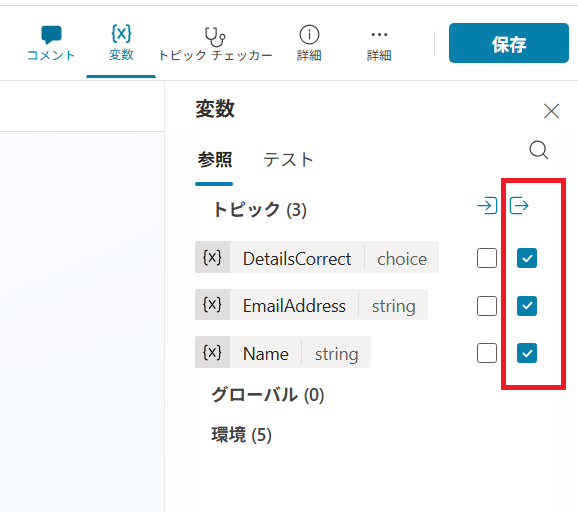

---
lab:
    title: 'ノードの管理'
    module: 'Microsoft Copilot Studioでトピックを管理する'
---

# ノードの管理

## シナリオ

この演習では、以下を実施します:

- 会話フローを作成する
- 変数を管理する

この演習の所要時間は約**30**分です。

## 学習内容

- トピックにノードを追加して会話フローを作成する方法

## ラボの概要

- 変数のスコープを構成する
- ノードを作成・編集する
- エージェントをテストし、認証を構成する
  
## 前提条件

- **Lab: トピックの管理**を完了していること

## 詳細な手順

## 演習1 - 変数のスコープ

他のトピックからアクセスできるように変数を有効にします。

### タスク1.1 - 変数のスコープを構成する

1. Copilot Studioポータル`https://copilotstudio.microsoft.com`にアクセスし、適切な環境にいることを確認します。

1. 左側のナビゲーションペインから**エージェント**を選びます。

1. 前のラボで作成した**Real Estate Booking Service**エージェントを選択します。

1. **トピック**タブを選択します。

1. **お客様詳細**トピックを選びます。

1. 上部のバーで**変数**を選択して変数ペインを開きます（**その他** \> **変数**を選択する必要がある場合があります）。

1. **トピック**変数を選択して展開します。

1. 3つのトピック変数の右側にあるチェックボックスを選択します。

    

1. **保存**を選択します。

## 演習2 - トピックを手動で作成する

トピック内の会話フローは、ノードを追加することで手動で作成できます。

### タスク2.1 - メッセージノードを追加する

1. **トピック**タブを選択します。

1. **内見予約**トピックを選びます。

1. トリガーノードの下にある **+** アイコンを選択し、**メッセージを送信する**を選びます。

1. **メッセージを入力する**フィールドに次のテキストを入力します:

    `こんにちは、不動産物件の内見予約をお手伝いします。`

1. **保存**を選択します。

### タスク2.2 - トピック管理ノードを追加する

1. **メッセージ**ノードの下にある **+** アイコンを選択し、**トピック管理** > **別のトピックに移動** > **お客様詳細**を選びます。

1. **保存**を選択します。

### タスク2.3 - 条件ノードを追加する

1. **トピック**ノードの下にある **+** アイコンを選択し、**条件を追加**を選びます。

1. **条件**ノード内の*変数を選択する*から**DetailsCorrect**変数を選択します。

1. **次と等しい**を選びます。

1. **値を入力または選択する**に、**はい**を選択します。

1. **保存**を選択します。

### タスク2.4 - 質問ノードを追加する

1. 左側の**条件**ノードの下にある **+** アイコンを選択し、**質問する**を選びます。

1. **メッセージを入力**フィールドに次のテキストを入力します:

    `どの物件を見学したいですか？`

1. **特定**で**ユーザーの応答全体**を選択します。

1. **ユーザーの応答を名前を付けて保存**の変数（Var1）を選択し、プロパティを開きます。

1. **変数名**に **`PropertyName`** と入力します。

1. **保存**を選択します。

1. 新しい**質問**ノードの下にある **+** アイコンを選択し、**質問する**を選びます。

1. **メッセージを入力**フィールドに次のテキストを入力します:

    `いつ物件を見学したいですか？日時を教えてください。`

1. **特定**で**日付と時刻**を選択します。

1. **ユーザーの応答を名前を付けて保存**の変数（Var1）を選択し、プロパティを開きます。

1. **変数名**に **`VisitDateTime`** と入力します。

1. 左側の**質問**ノードの下にある **+** アイコンを選択し、**メッセージを送信**を選びます。

1. **メッセージを入力**フィールドに次のテキストを入力します:

    `素晴らしい！それではスケジュールを設定しますね。`

1. **保存**を選択します。

### タスク2.5 - エージェントをテストする

1. **エージェントをテスト**パネルが開いていない場合は、ページ右上の**テスト**アイコンを選択してテストパネルを開きます。

1. ページ右上のテストパネル上部にある**省略記号 ...** メニューを選択します。

1. 有効になっていない場合は、**トピック間で追跡**を有効にします。

1. テストパネル上部の**新しいテストセッションを開始**アイコンを選択します。

1. **会話開始**メッセージが表示されたら、エージェントが会話を開始します。応答として、作成したトピックのトリガーフレーズを入力します:

    `内見の予約`

1. エージェントが「お名前を教えてください」という質問で応答します。

1. 名前を入力します。

1. メールアドレスを入力します。

1. 情報を入力すると、アダプティブカードに入力した情報が表示され、詳細が正しいかどうかを尋ねられます。**はい**を選択します。

1. **どの物件を見学したいですか？** のプロンプトに`555 Oak Lane, Denver, CO 80203`と入力します。

1. **いつ物件を見学したいですか？日時を教えてください。** のプロンプトに`明日の午前10時`と入力します。

## 演習3 - 認証の構成

### タスク3.1 - 認証を構成する

1. **Real Estate Booking Service**の右上にある**設定**を選択します。

1. **セキュリティ**タブを選びます。

1. **認証**を選択します。

1. **認証なし**を選びます。

1. **保存**を選択します。

1. 確認ウィンドウで**保存**を選択します。

1. 右上の**X**を選択して**設定**を閉じます。
