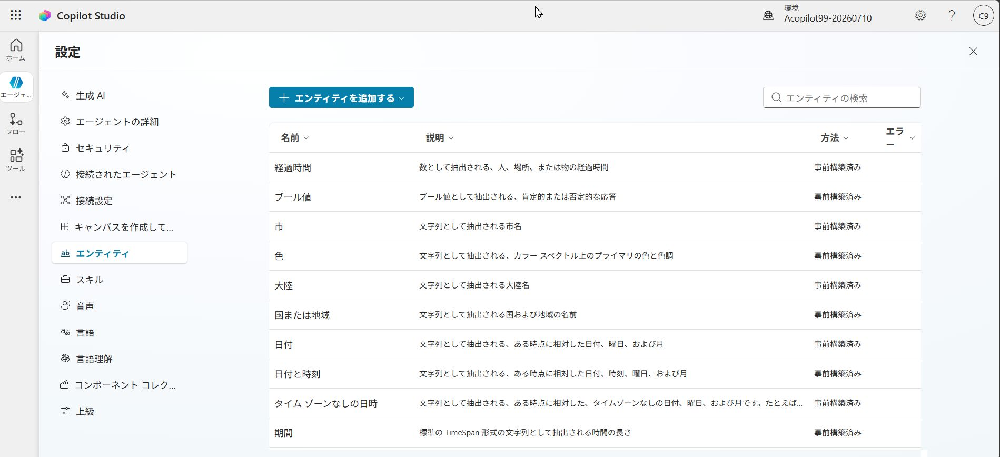
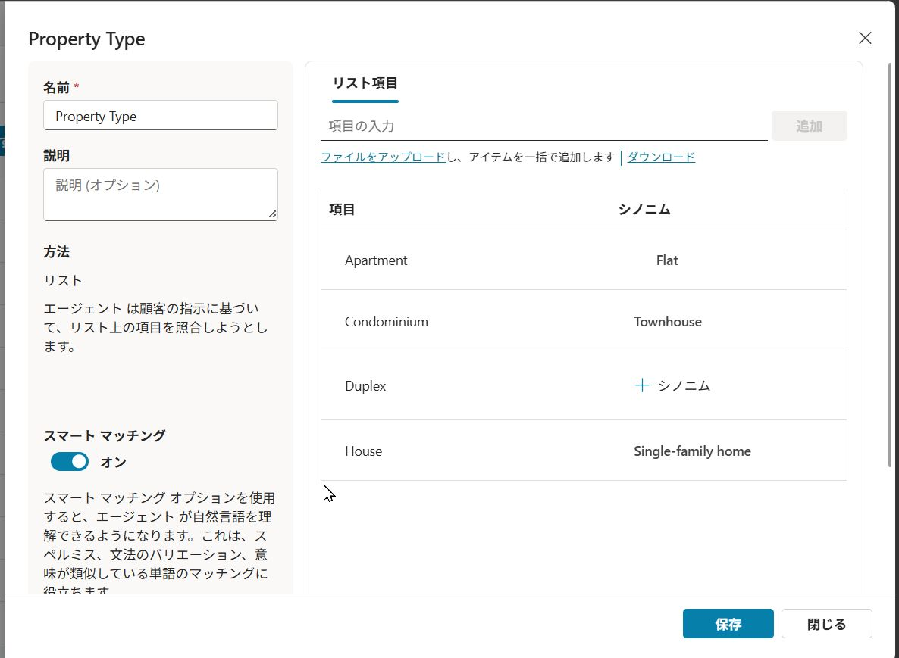
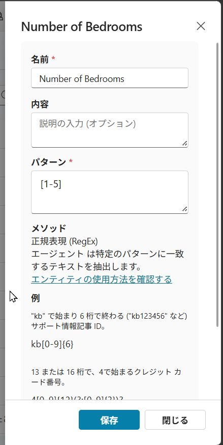
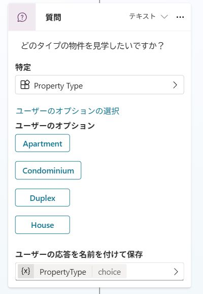
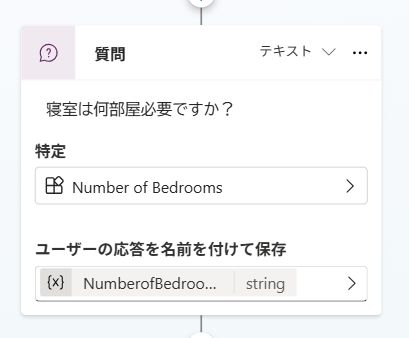

---
lab:
    title: 'エンティティを使った作業'
    module: 'Microsoft Copilot Studioでエンティティと変数を使った作業'
---

# エンティティを使った作業

## シナリオ

この演習では、以下を実施します:

- エンティティを作成して使用する

この演習の所要時間は約**15**分です。

## 学習内容

- エンティティを作成してエージェントを改善する方法

## ラボの概要

- エンティティを作成する
- ノードでエンティティを使用する
  
## 前提条件

- **Lab: ノードの管理**を完了していること

## 詳細な手順

## 演習1 - エンティティの作成

Microsoft Copilot Studioは、ユーザーの意図を理解するためにエンティティを使用します。一般的に使用される情報用に多くの事前構築済みエンティティが含まれています。特定の目的のためにカスタムエンティティを作成することもできます。

### タスク1.1 - 事前構築済みエンティティを表示する

1. Microsoft Copilot Studioポータル`https://copilotstudio.microsoft.com`にアクセスし、適切な環境にいることを確認します。

1. 左側のナビゲーションペインから**エージェント**を選びます。

1. 前のラボで作成した**Real Estate Booking Service**エージェントを選択します。

1. 画面右上の**設定**を選択します。

1. **エンティティ**タブを選びます。エージェント用の事前構築済みエンティティのリストが表示されるはずです。

    

### タスク1.2 - 物件タイプエンティティを作成する

1. **+ エンティティを追加** を選択し、 **+ 新しいエンティティ** を選びます。

1. **閉じているリスト**タイルを選択します。

1. **名前**フィールドに次のテキストを入力します:

    ```
    Property Type
    ```

1. リスト項目内の **項目の入力** フィールドに次のテキストを入力し、**追加** を選択します:

    ```
    Apartment
    ```

1. **項目の入力**フィールドに次のテキストを入力し、**追加**を選択します:

    ```
    Condominium
    ```

1. **項目の入力**フィールドに次のテキストを入力し、**追加**を選択します:

    ```
    Duplex
    ```

1. **項目の入力**フィールドに次のテキストを入力し、**追加**を選択します:

    ```
    House
    ```

1. **Apartment**の **+ シノニム**を選択し、次のテキストを入力して **+** アイコンを選択し、**完了**を選びます:

    ```
    Flat
    ```

1. **Condominium**の **+ シノニム**を選択し、次のテキストを入力して **+** アイコンを選択し、**完了**を選びます:

    ```
    Townhouse
    ```

1. **House**の **+ シノニム** を選択し、次のテキストを入力して **+** アイコンを選択し、**完了**を選びます:

    ```
    Single-family home
    ```

1. **スマートマッチング**を有効にします。

1. **保存**を選択します。

    

1. エンティティが保存されたら、Property Typeウィンドウを閉じます。

### タスク1.3 - 寝室数エンティティを作成する

1. **+ エンティティを追加**を選択し、**+ 新しいエンティティ**を選びます。

1. **正規表現（Regex）** タイルを選択します。

1. **名前**フィールドに次のテキストを入力します:

    ```
    Number of Bedrooms
    ```

1. **パターン**フィールドに次のテキストを入力します:

    ```
    [1-5]
    ```

1. **保存**を選択します。

    

1. エンティティが保存されたら、Number of Bedroomsペインを閉じます。

1. 右上の**X**アイコンを選択して設定を閉じ、エージェントに戻ります。

## 演習2 - エンティティを使用してエージェントを改善する

会話フローでエンティティを使用してエージェントを改善します。

### タスク2.1 - エンティティを使用する

1. **トピック**タブを選択します。

1. **内見予約**トピックを選びます。

1. **条件**ノードと物件の**質問**ノードの間にある **+** アイコンを選択し、**質問する**を選びます。

1. **メッセージを入力**フィールドに次のテキストを入力します:

    ```
    どのタイプの物件を見学したいですか？
    ```

1. **特定**で**Property Type**を選択します。

1. **ユーザー用のオプションを選択**を選び、4つの値すべてに対して**表示**オプションをチェックします。

    

1. **ユーザーの応答を次として保存**の変数を選択し、**変数名**に次のテキストを入力します:

    ```
    PropertyType
    ```

1. 新しい**質問**ノードの下にある **+** アイコンを選択し、**質問する**を選びます。

1. **メッセージを入力**フィールドに次のテキストを入力します:

    ```
    寝室は何部屋必要ですか？
    ```

1. **特定**で**Number of Bedrooms**を選択します。

1. **ユーザーの応答を次として保存**の変数を選択し、**変数名**に次のテキストを入力します:

    ```
    NumberofBedrooms
    ```

    

1. **保存**を選択します。
