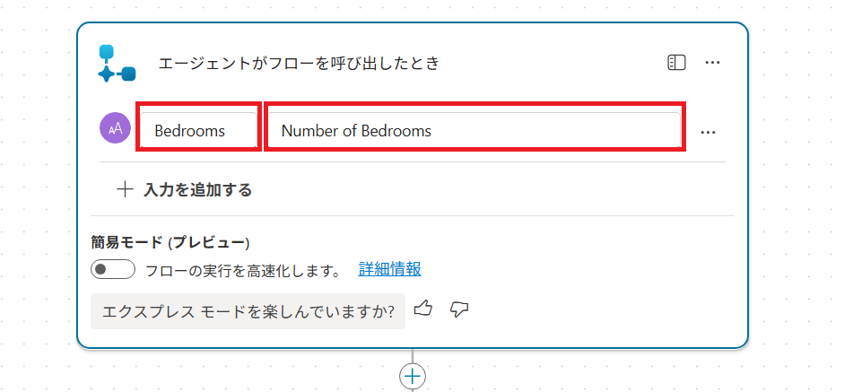
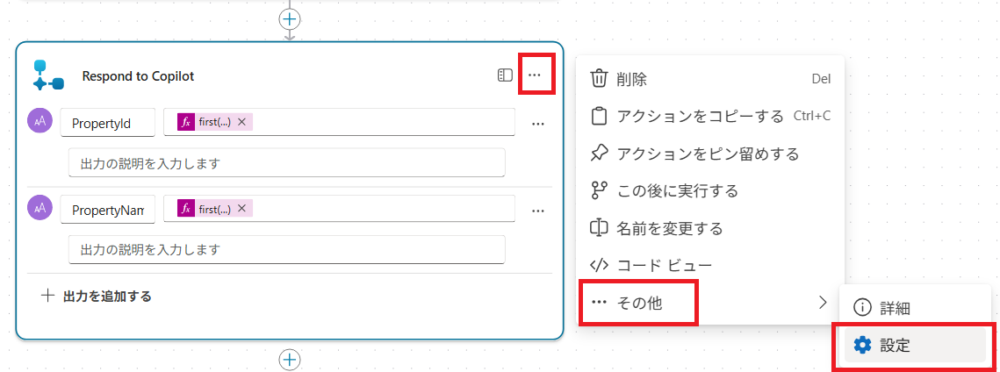
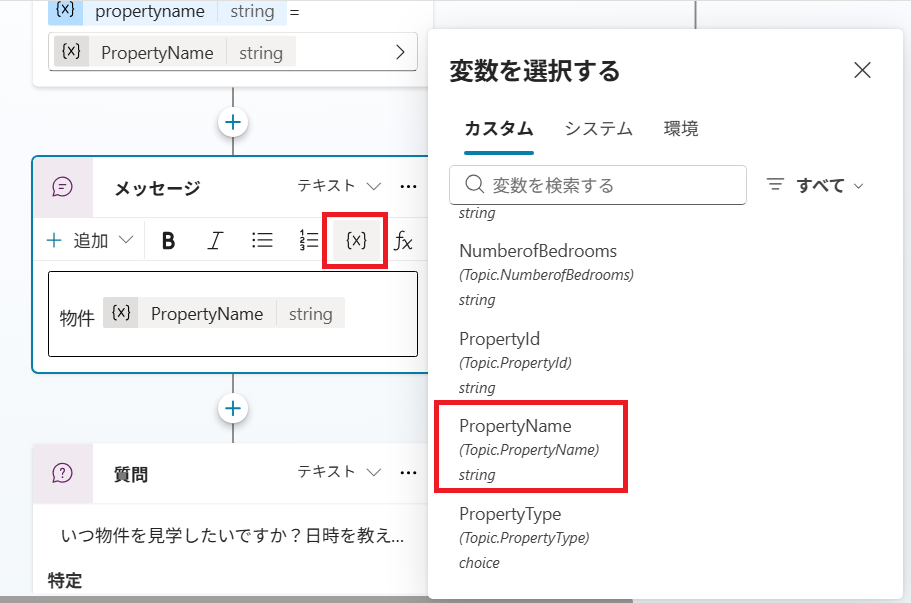
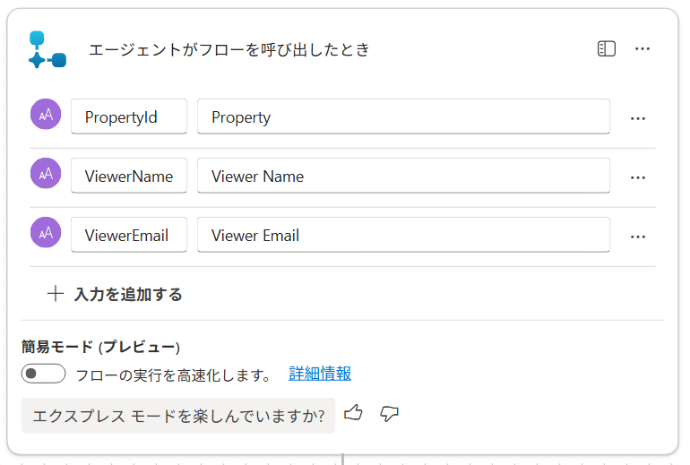
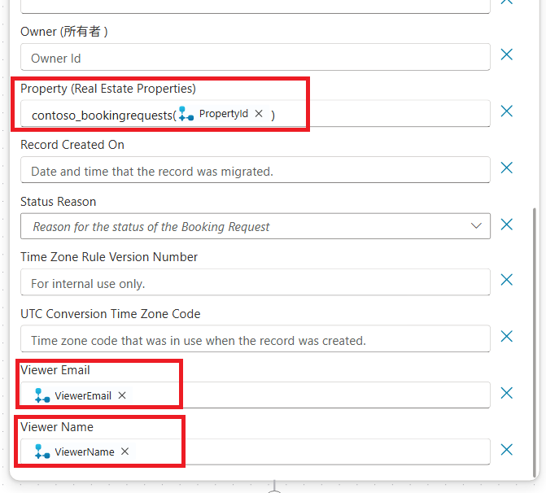

---
lab:
    title: 'エージェントフローの作成'
    module: 'Microsoft Copilot Studioエージェントの拡張'
---

# エージェントフローの作成

## シナリオ

この演習では、以下を実施します:

- エージェントフローを作成する

この演習の所要時間は約**30**分です。

## 学習内容

- Copilot Studioでエージェントフローを実行するためのツールを作成する方法

## ラボの概要

- Dataverseデータを取得するエージェントフローを作成する
- Dataverseデータを作成するエージェントフローを作成する
  
## 前提条件

- **Lab: エンティティを使った作業**を完了していること

## 詳細な手順

## 演習1 - Dataverseからデータを取得するツールの作成

Microsoft Copilot Studioは、エージェントフローを使用してMicrosoft Dataverseのデータにアクセスできます。

### タスク1.1 - 物件を取得するエージェントフローを作成する

1. Microsoft Copilot Studioポータル`https://copilotstudio.microsoft.com`にアクセスし、適切な環境にいることを確認します。

1. 左側のナビゲーションペインから**エージェント**を選びます。

1. 前のラボで作成した**Real Estate Booking Service**を選択します。

1. **ツール**タブを選択します。

1. **+ ツールを追加**を選びます。

1. **新規作成**の下で、**エージェントフロー**を選択します。

1. トリガーステップ**エージェントがフローを呼び出したとき**を選択し、**+ 入力を追加**を選びます。

1. **テキスト**を選択します。

1. **テキストフィールド**に`Bedrooms`、**入力を指定してください**に`Number of Bedrooms`と入力します。

    

1. ページ右上付近の**下書きを保存**を選択します。

1. フローの2つのステップの間にある **+** アイコンを選択して、新しいアクションを追加します。

1. **検索**フィールドに`Dataverse`と入力し、**Microsoft Dataverse**コネクタの**詳しく見る**を選びます。

    

1. **`行を一覧にする`** アクションを選択します。

1. 認証を求められた場合は、**接続名**に`Lab connection`と入力し、**認証の種類**で**OAuth**を選択し、**サインイン**を選択して、テナントの資格情報を使用して**アクセスを許可**します。

    > **注意**: '**OAuth接続の作成に失敗しました**'エラーが表示される場合は、ブラウザでポップアップを許可する必要がある場合があります。

rea1. テーブル名で**Real Estate Properties**を選択します。

1. **行のフィルター**フィールドに`contoso_bedrooms eq `（**eq**の後にスペースを入れて）と入力します。

1. **行のフィルター**フィールドが選択されたままの状態で、その右側にある**稲妻**アイコンを選択し、**Bedrooms**パラメータを選びます。

    > **重要**: eqとBedroomsの間にスペースがあることを確認してください。

1. ページ右上付近の**下書きを保存**を選択します。

1. オーサリングキャンバスの **Respond to Copilot** アクションを選択し、**+ 出力を追加**を選びます。

1. **テキスト**を選択します。

1. **名前を入力する**に`PropertyId`と入力します。

1. **応答に使用する値を入力してください**フィールドを選択し、その右側にある **fx（式の挿入）** を選びます。

1. 上部のフィールドに次の式を入力します:

    ```
    first(outputs('行を一覧にする')?['body/value'])['contoso_realestatepropertyid']
    ```

1. **追加**を選択します。

1. **+ 出力を追加**を選びます。

1. **テキスト**を選択します。

1. **名前を入力する**に`PropertyName`と入力します。

1. **応答に使用する値を入力してください**フィールドを選択し、その右側にある **fx（式の挿入）** を選びます。

1. 次の式を入力します:

    ```
    first(outputs('行を一覧にする')?['body/value'])['contoso_propertyname']
    ```

1. **追加**を選択します。

1. **Respond to Copilot**ペインで、右側の **…（三点リーダー）**内の **その他** と進み、 **設定**タブを選択します。

    

1. **非同期応答**が**オフ**に設定されていることを確認します。

1. ページ右上付近の**下書きを保存**を選択します。

1. 左メニューの**フロー**をクリックします、 先ほど作った **無題**のフローを選択します。

1. **詳細**セクションで編集を選択し、フローの**名前**を`Get Property`に更新します。

1. **説明**を`適切な寝室数の物件を取得する`に更新します。

1. **保存**を選択します。

1. 左メニューの**フロー**をクリックします。

1. 一覧内の**Get Property**にカーソルを合わせ、**右側にある…** をクリックし、**エージェントフローを編集する**に進みます。

1. **公開**を選択します。

1. 左メニューの**フロー**を選択し、作成したGet Propertyフローの状態が公開済みになっていることを確認します。

### タスク1.2 - Get Propertyツールをトピックに追加する

1. 左メニューの**エージェント**を選択し、**Real Estate Booking Service** を選択します。

1. **トピック**タブを選択します。

1. **内見予約**トピックを選びます。

1. **寝室は何部屋必要ですか？**質問ノードの下にある**+** アイコンを選択し、**ツールを追加**を選び、**ツール**タブを選択してから、**Get Property**エージェントフローを選びます。

1. Power Automate入力(1) **`Bedrooms`** の入力欄に変数を設定します。入力欄右側の…をクリックし、カスタム内の **`NumberofBedrooms`** を設定します。

1. **どの物件を見学したいですか？** 質問ノードの**省略記号（...）** を選択し、**削除**を選びます。

1. **ツール**ノードの下にある **+** アイコンを選択し、**メッセージを送信**を選びます。

1. **メッセージを入力** フィールドに`物件 `（後ろにスペースを入れて）と入力します。

1. 同じノードで、**{X}（変数の挿入）** アイコンを選択し、**PropertyName**変数を選びます。

    

1. **保存** を選択します。

## 演習2 - Dataverseにデータを作成するツールの作成

Microsoft Copilot Studioは、エージェントフローを使用してMicrosoft Dataverseでデータを作成できます。

### タスク2.1 - 予約を作成するエージェントフローを作成する

1. **Real Estate Booking Service**の**ツール**タブを選択します。

1. **+ ツールを追加**を選びます。

1. **+ 新しいツール**を選択してから、**エージェントフロー**を選びます。

1. **下書きを保存**を選択し、エージェントフローが保存されるまで待ちます。

1. **概要**タブを選択します。

1. **詳細**セクションで**編集**を選択します。

1. フロー名を`Create Booking Request`に変更します。

1. **保存**を選択します。

1. **デザイナー**タブを選択します。

1. トリガーステップ**エージェントがフローを呼び出したとき**を選択し、**+ 入力を追加**を選びます。

1. **テキスト**を選択します。

1. **テキストフィールド**に`PropertyId`、**入力を指定してください**に`Property`と入力します。

1. **+ 入力を追加**を選びます。

1. **テキスト**を選択します。

1. **テキストフィールド**に`ViewerName`、**入力を指定してください**に`Viewer Name`と入力します。

1. **+ 入力を追加**を選びます。

1. **テキスト**を選択します。

1. **テキストフィールド**に`ViewerEmail`、**入力を指定してください**に`Viewer Email`と入力します。

    

1. フローの2つのステップの間にある **+** アイコンを選択して、新しいアクションを追加します。

1. **検索**フィールドに`Dataverse`と入力し、**Microsoft Dataverse**コネクタの**詳しく見る**を選びます。

1. **新しい行を追加する**アクションを選択します。

1. テーブル名で**Booking Requests**を選択します。

1. **Booking Name**フィールドに`Agent booking`と入力します。

1. **詳細パラメータ**の**すべて表示**を選択します。

1. **Property (Real Estate Properties)** フィールドに`contoso_bookingrequests()`と入力し、括弧内にカーソルを移動して、**稲妻**アイコンを選択し、**PropertyId**パラメータを選びます（つまり、引数としてPropertyIdを設定します）。

1. **Viewer Email**フィールドを選択し、**稲妻**アイコンを選択してから、**ViewerEmail**パラメータを選びます。

1. **Viewer Name**フィールドを選択し、**稲妻**アイコンを選択してから、**ViewerName**パラメータを選びます。

    

1. **Respond to Copilot**ペインで、右側の **…（三点リーダー）** 内の **その他** と進み、 **設定**タブを選択します。

1. **非同期応答**が**オフ**に設定されていることを確認します。

1. ウィンドウの右上にある**下書きを保存**を選択します。

1. 保存が完了するまで待ってから、**公開**を選択します。

### タスク2.2 - ツールを検証する

1. 左メニュー内の **ツール** タブを選択し、両方のエージェントフローがリストにあることを確認します。ない場合は、**+ ツールを追加** > **フロー** > を選択して、不足しているエージェントフローを選びます。**追加して構成**を選択します。

### タスク2.3 - Create Booking Requestツールをトピックに追加する

1. 左メニュー内の**エージェント**を選択し、**Real Estate Booking Service**エージェントを開きます。

1. **トピック**タブを選択します。

1. **内見予約**トピックを選びます。

1. 最下部の**メッセージ**ノードの下にある **+** アイコンを選択し、**ツールを追加**を選択してから、**Create Booking Request**フローを選びます。

1. **PropertyId**入力パラメータに**PropertyId**変数を選択します（入力欄右側の…をクリック）。

1. **ViewerName**入力パラメータに**Name**変数を選択します。

1. **ViewerEmail**入力パラメータに**EmailAddress**変数を選択します。

1. 新しい**アクション**ノードの下にある **+** アイコンを選択し、**トピック管理**を選択し、**別のトピックに移動**を選択してから、**会話の終了**を選びます。

1. **保存**を選択します。

## 演習3 - エージェントをテストする

### タスク3.1 - 予約リクエストを作成する

1. 閉じている場合は、ページ右上の**テスト**アイコンを選択してテストパネルを開きます。

1. ページ右上のテストパネル上部にある**省略記号 ...** メニューを選択します。

1. 有効になっていない場合は、**トピック間で追跡**を有効にします。

1. テストパネル上部の**新しいテストセッションを開始**アイコンを選択します。

1. **会話開始**メッセージが表示されたら、エージェントが会話を開始します。応答として、作成したトピックのトリガーフレーズを入力します:

    `内見の予約`

1. 名前とメールアドレスを入力します。

1. 情報を入力すると、アダプティブカードに入力した情報が表示され、詳細が正しいかどうかを尋ねられます。**はい**を選択します。

1. 物件タイプのプロンプトで**House**を選択します。

1. 寝室数のプロンプトに`3`と入力します。

1. **いつ物件を見学したいですか？日時を教えてください。** のプロンプトに`明日の午後2時`と入力します。

1. **質問への回答になりましたか？**のプロンプトに**はい**を選択します。

1. 任意の評価を選択します。

1. **他に何かお手伝いできることはありますか？**のプロンプトに**いいえ**と入力します。

### タスク3.2 - 予約リクエストを確認する

1. まだ開いていない場合は、新しいタブで`https://make.powerapps.com`にアクセスします。

1. 適切な環境にいることを確認します。

1. 左側のナビゲーションで**アプリ**を選びます。

1. **Real Estate Property Management**モデル駆動型アプリの**再生**を選択します。

1. 左側のナビゲーションで**Booking Requests**を選びます。エージェントが作成した予約リクエストを確認します。
